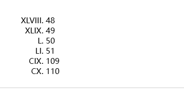

## counter_style
让你自定义计数器样式的 CSS 模块。

### counter-reset
创建具名 CSS 计数器，并将其初始化为指定值。它支持创建从 1 向上计数到元素数量的计数器，以及从元素数量向下计数到 1 的计数器。
- <自定义 ID> [<数值>]。你可以指定任意数量的计数器进行重置，每个名称或“名称 - 数字”对之间用空格分隔。
- 特殊值 none。
- reversed 实验属性，大部分不支持


### counter-set
将 CSS 计数器设置为给定值。它会操作现有计数器的值，并且只有在元素上没有给定名称的计数器时才会创建新计数器。
```css 
/* 将 "my-counter" 设置为 0 */
counter-set: my-counter;

/* 将 "my-counter" 设置为 -1 */
counter-set: my-counter -1;
```

### counter-increment
将CSS Counters的值增加给定值。可以使用 counter-reset 属性重置计数器的值。
```css 
/* Increment counter-name by 1 */
counter-increment: counter-name;

/* Decrement counter-name by 1 */
counter-increment: counter-name -1;
/* Increment counter1 by 1, and decrement counter2 by 4 */
counter-increment: counter 1 counter2 -4;
```

### list-stye-type
设置列表元素的 marker（比如圆点、符号、或者自定义计数器样式）。
list-style-type 属性可以应用在任何 display 的值为 list-item 的元素上。
list-style-type 的属性值可以是以下任意一项:

- a <custom-ident> value
- a symbols() value
- a <string> value
- the keyword none。
```css
list-style-type: disc;
```

### list-style
属性是一个简写对属性集合，包括list-style-type, list-style-image, 和 list-style-position。
```css
list-style: disc inside;
```

### list-style-image
```css
list-style-image: url("../../media/examples/rocket.svg");
```

### counter
返回一个代表计数器的当前值的字符串。它通常和伪元素搭配使用，但是理论上可以在支持<string>值的任何地方使用。
```css
/* 简单的用法 */
counter(countername);

/* 改变计数器的显示 */
counter(countername, upper-roman)

```

### counters
嵌套计数器，返回表示指定计数器当前值的连接字符串。counters() 函数有两种形式：counters(name, string) 或 counters(name, string, style)。它通常和伪元素搭配使用，但是理论上可以在支持<string>值的任何地方使用。生成的文本是具有给定名称的所有计数器的值，从最外层到最内层，之间由指定字符串分隔。计数器以指示的样式呈现，如果未指定样式，则默认为十进制。
```css
/* Simple usage  - style defaults to decimal */
counters(countername, '-');

/* changing the counter display */
counters(countername, '.', upper-roman)
```

### @counter-style
@counter-style 是一个 CSS at-rule ，它让开发者可以自定义 counter 的样式。一个 @counter-style 规则定义了如何把一个计数器的值转化为字符串表示。
```css
@counter-style <counter-style-name> {
    system: <counter system>
    symbols: <counter symbols>
    additive-symbols: <additive-symbols>
    negative: <negative symbol>
    prefix: <prefix>
    suffix: <suffix>
    range: <range>
    pad: <padding>
    speak-as: <speak-as>
    fallback: <counter-style-name>
}
```
- system  指定一个算法，用于将计数器的整数值转化为字符串表示。
- negative  指定一个符号，当计数器表示的值为负的时候，把这个符号加在值的前面或后面
- prefix 指定一个符号，加在标记表示符的前面。前缀在最后阶段才会被加上，所以在计数器的最终表示中，它在negative前。
- suffix 与prefix类似，suffix 指定一个符号，加在标记表示符的后面。
- range 指定一个 counter-style 生效的范围，如果计数器的值不再这个范围内，那么自定义的 counter-style 不会生效，counter-style 会后退到fallback的 style。
- pad 在你想要给标记表示符最小值时使用。比如说，你想要计数器从 01 开始，经过 02，03，04，那么这时可以使用 pad 了。对于大于 pad 指定值的表示符，标记会恢复为 normal。
- fallback 定义一个备用的系统，当自定义的系统不能使用或者计数器的值超过了定义的范围时使用。如果备用系统也不能表示计数器的值，那么备用系统的备用系统（如果有的话）将会启用。如果没有指定备用系统，或者备用系统链不能够正确表示一个值，那么最终会降为十进制样式表示。
- symbols 定义一个符号，用于标记的表示。符号可以包含字符串，图片或自定义的识别码。
- additive-symbols 
- speak-as 定义如何在语音识别器中读出计数器样式

```css
@counter-style circled-alpha {
  system: fixed;
  symbols: Ⓐ Ⓑ Ⓒ Ⓓ Ⓔ Ⓕ Ⓖ Ⓗ Ⓘ Ⓙ Ⓚ Ⓛ Ⓜ Ⓝ Ⓞ Ⓟ Ⓠ Ⓡ Ⓢ Ⓣ Ⓤ Ⓥ Ⓦ Ⓧ Ⓨ Ⓩ;
  suffix: " ";
}
.items {
  list-style: circled-alpha;
}
```
### symbols 
```css
symbols: A B C D E;
symbols: "\24B6" "\24B7" "\24B8" D E;
symbols: "0" "1" "2" "4" "5" "6" "7" "8" "9";
symbols: url("one.svg") url("two.svg") url("three.svg");
symbols: indic-numbers;
```


### system
描述符指定了用于将计数器的整数值转换为字符串表示形式的算法。
```css
/* Keyword values */
system: cyclic;
system: numeric;
system: alphabetic;
system: symbolic;
system: additive;
system: fixed;

/* Other values */
system: fixed 3;
system: extends decimal;
system: extends circled-letters;

```
- cyclic numeric alphabetic symbolic additive fixed 其中之一
- 关键字是fix 时可以指定一个数字，表示从 0 开始计数，比如说 system: fixed 3 时计数器从 3 开始计数。
- extends 可以伴随一个  <counter-style-name> 值，来集成它

- cyclic 遍历循环符号列表，达到末尾，回到起点重新开始
- numeric 将计数器符号解释为位值编号系统中的数字。数值系统类似于alphabetic，但是位值编号从 0 开始。
- alphabetic 将指定的符号解释为数字，并采用字母编号系统。如果symbls 是"a"到"z"，则前26个字母会显示"a" ,  "b" 到 "z" 。然而,在 "z" ,它将继续显示未 "aa" ,  "ab" ,  "ac" 
- symbolic 循环遍历 symbols 描述符列表中提供的符号，将符号加倍、三倍，以此类推，每次连续遍历该列表。
- additive 用于表示“符号-值”编号系统，例如罗马数字，它不会重复使用不同位置的数字来获得不同的值，而是为更大的值定义额外的数字。在这种系统中，数字的值可以通过将数字中的数字相加来求出。
- fixed 定义一个有限的符号集合，遍历 symbols 描述符提供的符号列表一次。在遍历指定的符号之后，将使用备用计数器样式。

# 示例
```css
@counter-style fisheye {
  system: cyclic;
  symbols: ◉ ➀;
  suffix: ": ";
}

ul {
  list-style: fisheye;
}
```
# additive 示例：
```html
<ol start="48">
  <li>48</li>
  <li>49</li>
  <li>50</li>
  <li>51</li>
  <li value="109">109</li>
  <li>110</li>
  <ol></ol>
</ol>

```
```css
@counter-style uppercase-roman {
  system: additive;
  range: 1 3999;
  additive-symbols:
    1000 M,
    900 CM,
    500 D,
    400 CD,
    100 C,
    90 XC,
    50 L,
    40 XL,
    10 X,
    9 IX,
    5 V,
    4 IV,
    1 I;
}

ol {
  list-style: uppercase-roman;
  padding-left: 5em;
}
```

- 可以看到 48 等于40+5 + 1 +1 +1 = XLVIII
- 110 = 100 + 10 = CX


### ::marker
::marker CSS 伪元素匹配列表的标记框（通常为一个符号或数字）。它作用在任何设置了 display: list-item 的元素或伪元素上，例如 <li> 和 <summary> 元素。
```css
ul li::marker {
  color: red;
  font-size: 1.5em;
}
```