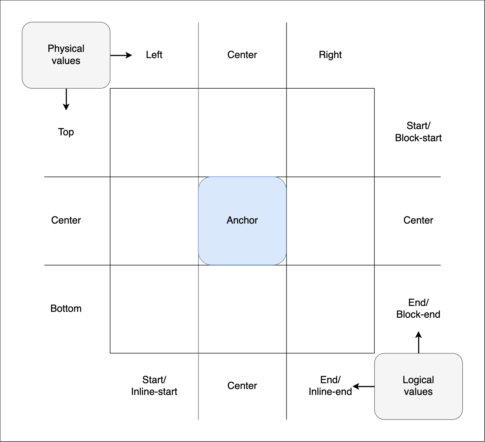

## css锚点定位
实验属性:css-anchor

锚点定位定义了将元素和锚点联系在一起的功能，元素可以根据其绑定的锚点元素的大小和位置进行定位

1. 定义一个锚点元素 名称为--my-anchor，必须以双短横线开头
```css
.anchor-element {
  anchor-name: --my-anchor;
}
```
2. 设置锚点元素的位置 
```css
.box {
  /* 指定关联的锚点元素 */
  position-anchor: --myAnchor;
  /* 指定根据锚点元素的定位类型 */
  position: fixed;
  /* 指定box元素的位置 */
  left: anchor(left);
  top: anchor(top);
}
```
position-area （旧名称 inset-area） 在锚点元素周围形成3*3的网格区域，每个cell具有自己的名称

* 行可以使用物理值top、center、bottom，逻辑值block-start、center、block-end，坐标值y-start、center、y-end
* 列可以使用物理值left、center、right，逻辑值inline-start、center、inline-end，坐标值x-start、center、x-end
* 设置元素跨栏位，使用 span-left、span-right、spaan-all 等设置元素在中心然后跨到其他栏位
* 自对其属性，可以使用align-self和justify-self 进行自定位，其中anchor-centerd表示定位到锚点元素的中心
```css
/* 使用position-area定位 */
.box {
  /* 指定关联的锚点元素 */
  position-anchor: --myAnchor;
  /* 指定根据锚点元素的定位类型 */
  position: fixed;
  /* 指定box元素的位置 */
  position-area: left center;
}
```
3. 锚点尺寸
获取锚点元素的宽高 anchor-seze
```css
.box {
  /* 指定关联的锚点元素 */
  position-anchor: --myAnchor;
  /* 指定根据锚点元素的定位类型 */
  position: fixed;
  /* 指定box元素的位置 */
  left: anchor(left);
  top: anchor(top);

  /* 获取锚点元素的尺寸 */
  width: anchor-size(width);
  height: anchor-size(height);
}
```
4. 动态调整位置
    position-try-fallback  还未实现的简写：position-try，旧名position-try-options 不再支持
    * 元素在锚点上方，如果元素放不开则放到下方
    ```css
    .box {
    /* 指定关联的锚点元素 */
    position-anchor: --myAnchor;
    /* 指定根据锚点元素的定位类型 */
    position: fixed;

    /* 指定box元素的默认位置 */
    position-area: top center;

    /* 指定box元素的动态调整位置 */
    position-try-fallback： bottom center;
    }
    /* 设置动态规则的定义 */
    @position-try --bottom{
        position-area: bottom center;
    }
    ```
    * 元素简写 flip-block 垂直翻转 flip-inline 水平翻转  flip-start 对角线反转
    ```css
    .box {
    /* 指定关联的锚点元素 */
    position-anchor: --myAnchor;
    /* 指定根据锚点元素的定位类型 */
    position: fixed;
    /* 指定box元素的位置 */
    position-area: left center;

    /* 指定box元素的动态调整位置 */
    position-try-fallback： flip-block, flip-inline;

    /* 
    注意在指定了flip-block, flip-inline 之后浏览器要么水平翻转要么垂直翻转不能同时都翻转
    想要同时翻转则需要添加 flip-block flip-inline 注意没有逗号
    */
    position-try-fallback： flip-block, flip-inline,  flip-block flip-inline;
        /* 组合position-area的值，做到更细粒度的定位，可以向左滚动时，先在左上角，再移动到上方中间，然后移动到上方右侧 */
    position-try-fallbacks:
            top, top right, right,
            bottom right, bottom,
            bottom left, left;

    }

5. opsiton-try-order
    属性用于指定在多个可能的定位位置中，浏览器应该优先选择哪种位置。它有以下值：
    1. `normal`（默认值）
    - 按照声明的顺序尝试每个位置
    - 选择第一个符合条件的位置

    2. `most-height`
    - 优先选择在视口中可见高度最大的位置
    - 适用于需要显示较多垂直内容的情况（如长列表）
    3. `most-width`
    - 优先选择在视口中可见宽度最大的位置
    - 适用于需要显示较宽内容的情况（如宽表格）

    4. `most-block-size`
    - 优先选择在块方向（通常是垂直方向）上可用空间最大的位置
    - 考虑文档的书写模式

    5. `most-inline-size`
    - 优先选择在行内方向（通常是水平方向）上可用空间最大的位置
    - 考虑文档的书写模式

    ```css
    /* 可用的value normal most-height most-width most-block-size most-inline-size*/
    .box {
        position-try-order: most-height;
    }
    ```
6. position-try
    是position-try-orderr 和 position-tryfallback的简写
    ```css
    .box {
        /* 指定关联的锚点元素 */
        position-anchor: --myAnchor;
        /* 指定根据锚点元素的定位类型 */
        position: fixed;
        /* 指定box元素的默认位置 */
        position-area: top center;

        /* 指定box元素的动态调整位置 */
        position-try: most-height flip-height;
    }
    ```
7. position-visibility
    有条件的隐藏定位元素值为
    1. always 元素始终显示
    2. anchors-visible 如果锚点被完全隐藏，不管是溢出视口还是被其他元素覆盖，定位元素隐藏
    3. no-overflow 如果《《定位元素》》开始溢出其包含元素或视口，则隐藏

8. anchor() 语法
   用于定位
   ```css
   .box {
    /* 指定关联的锚点元素 */
    position-anchor: --myAnchor;
    /* 指定根据锚点元素的定位类型 */
    position: fixed;
    /* 指定box元素的位置 */
    left: anchor(left);
    top: anchor(top);

    top: anchor(bottom);
    top: anchor(50%);
    top: calc(anchor(bottom) + 10px);
    inset-block-end: anchor(start);

    
   }
   ```