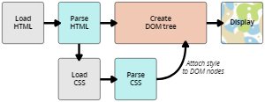

CSS 如何运行

1. 浏览器载入HTML文件
2. HTML文件转化为一个DOM
3. 浏览器拉去HTML相关的资源，如图片、视频、样式
4. 浏览器拉去CSS后会进行解析，根据选择器类型不同（class、id、标签等）把他们分到不同的桶中，浏览器基于它找到的不同的选择器，将不同的规则应用在对应的元素上，并添加节点依赖的样式。这个中间步骤成为渲染树
5. 规则应用于渲染树后，渲染树会依照应该出现的结构进行布局
6. 网页展示在屏幕上，成为着色

当浏览器遇到无法解析的 CSS 选择器或声明的时候,浏览器什么也不会做，继续解析下一个 CSS 样式！被组合起来的选择器，如果有一个无法解析，整个规则都会失效